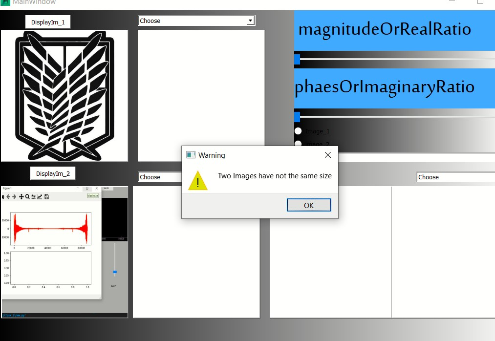
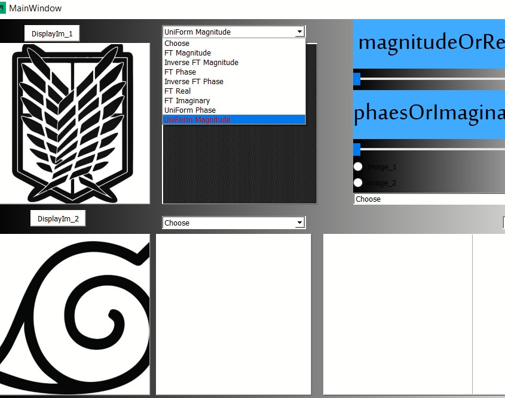
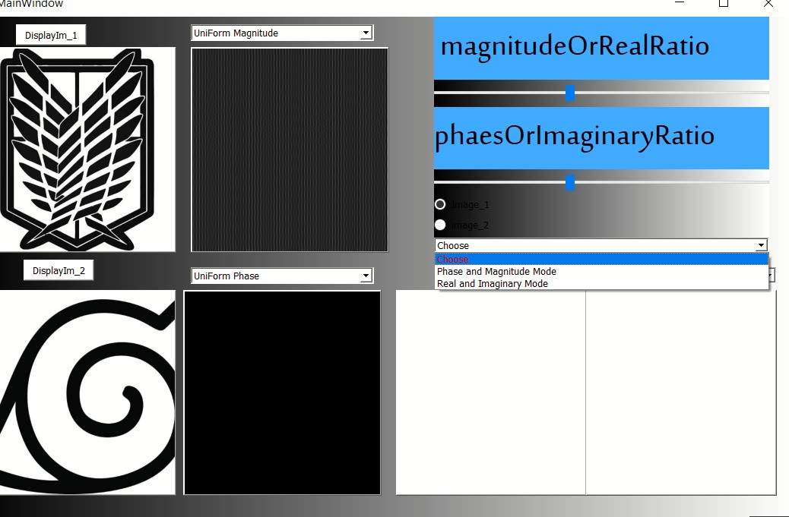
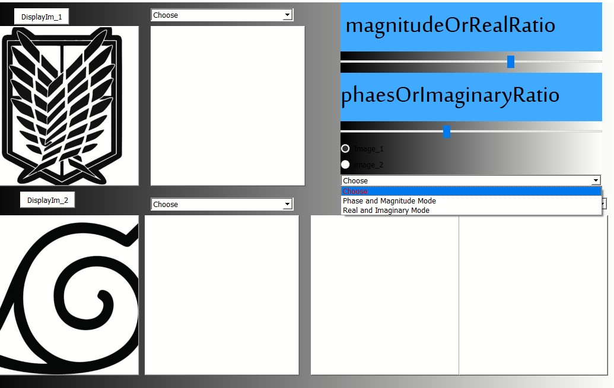
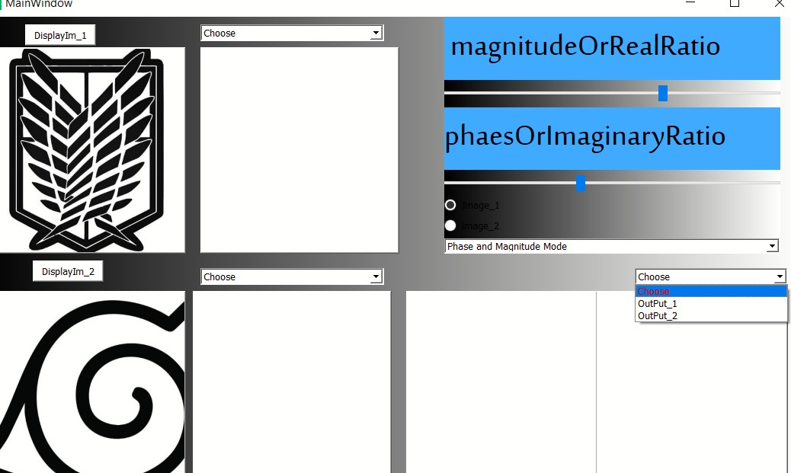
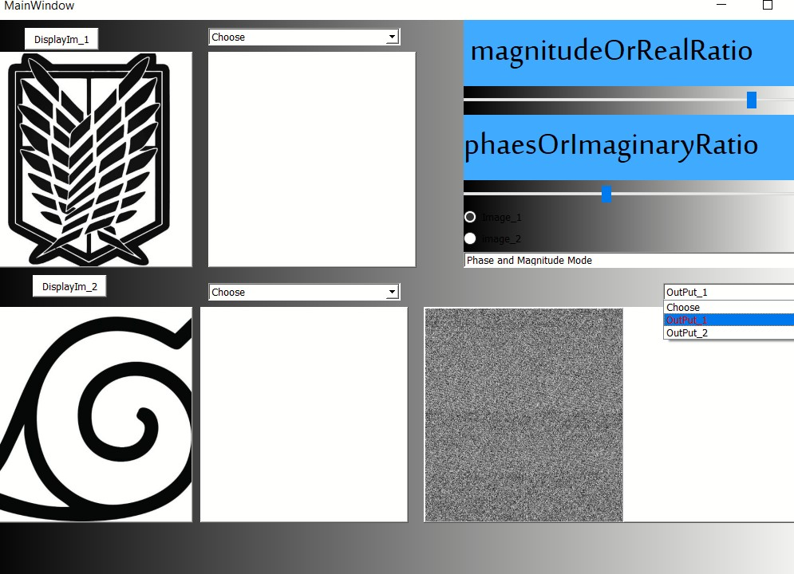
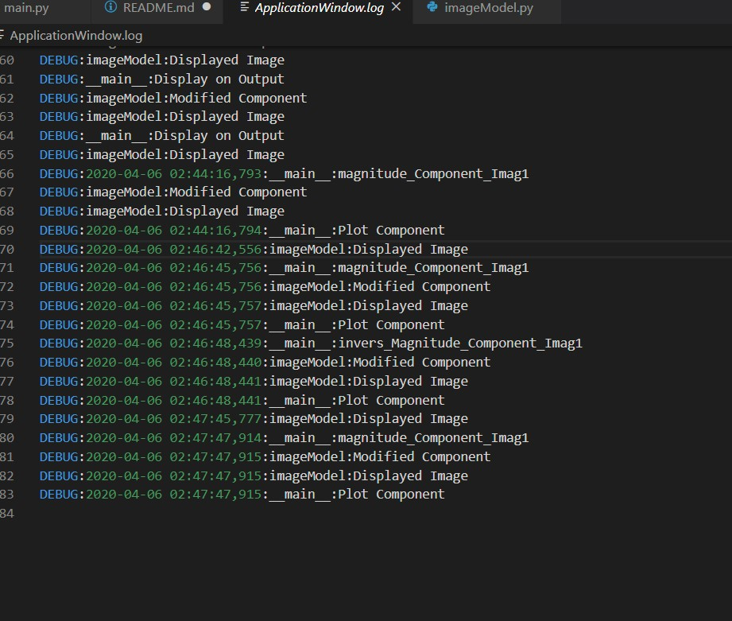

#### Name: Shymaa gamal said
#### Sec:2
#### ID: 1
# Steps

 ## **User can open any two Image but if open two image with different size , application appear warning message as shown**
  

 ## **User can easily choose any component from comboBox for current image**
 

## **If user want to mix between two component  ,he can easily move slider to send ratio and choose one image and automatic application take other image to mix with**

## **user must choose any mode he want to deal with**

## **After that he can choose any window to display output**

## **but unfortunately i don't know what is the problem in my implementation  to display this output ,Although I wrote equation as doctor refered to on platform**

## **I Tried to apply logging to trace my code**
